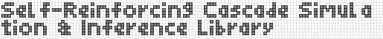

<p align="center">
  
</p>

This library provides an implementation for the simulation, analysis, and statistical inference of Self-Reinforcing Cascade (SRC) models, as introduced in Hébert-Dufresne et al., Phys. Rev. Lett. 135, 087401.

The software is designed for reproducible computational experiments. It includes a flexible simulation environment with multiple backends, analytical solvers based on probability generating functions (PGFs), mean-field approximations for network-based cascades, and a statistical inference module for fitting model parameters to empirical data.

## Scientific context and utility

The primary utility of this library is its precise and efficient implementation of a model that can generate cascades with non-universal, tunable power-law exponents. This capability directly addresses a significant gap between the predictions of classic cascade models, which typically exhibit universal scaling exponents (e.g., τ = 3/2), and the diverse scaling behavior observed in empirical data, particularly from social media platforms. The library is therefore a tool for investigating phenomena where this "extended criticality" (critical-like behavior over a range of parameters) is hypothesized to play a role. Its intended users include computational social scientists, physicists studying critical phenomena, and researchers modeling the spread of information, culture, or innovation.

## Installation and build requirements

The library requires Python 3.9+ and a C++17 compliant compiler (e.g., GCC, Clang, or MSVC) for the high-performance backend. Dependencies are listed in `pyproject.toml` and include `numpy`, `scipy`, `networkx`, `emcee`, and `pybind11`.

To install the library and compile the C++ extension module, clone the repository and execute the following command from the project's root directory:

```bash
pip install -e .
```

This command uses `setuptools` to build the `pybind11` C++ extension and installs the package in editable mode, which makes changes to the source code immediately available without reinstallation.

## Core components

The library is organized into several modules, each serving a distinct function in the research workflow.

### `src_cascades.simulator`

This module contains classes for simulating the cascade process. The `SRCSimulator` class operates on abstract branching processes, which is suitable for theoretical exploration and comparison with analytical results. The `NetworkSRCSimulator` class operates on `networkx` graph objects, allowing for simulations on empirical or synthetic network topologies. The `SRCSimulator` supports two computational backends: a flexible `'python'` backend and a high-performance `'cpp'` backend.

### `src_cascades.solver`

This module implements the PGF fixed-point iteration method described in the source paper. The `PGFSolver` class can be used to find semi-analytical solutions for cascade size distributions, the probability of supercritical cascades, and the expected cascade size for models defined on a branching process. The underlying equations assume standard `k -> k +/- 1` dynamics.

### `src_cascades.analysis`

This module provides higher-level analytical functions. The `analyze_traveling_wave` function solves the transcendental equations from the paper to find the properties of the wave front in the supercritical regime. The `analyze_network_criticality` function implements a mean-field approximation to estimate the critical reinforcement probability (`p_c`) for a cascade on a network with a given degree distribution.

### `src_cascades.inference`

This module provides the `Fitter` class for parameter estimation from empirical data. It facilitates model fitting through Maximum Likelihood Estimation (MLE) via `scipy.optimize` and Bayesian inference via the Markov Chain Monte Carlo (MCMC) sampler `emcee`. The likelihood function is approximated via simulation, a technique related to Approximate Bayesian Computation (ABC). The module also reports model selection criteria such as Akaike Information Criterion (AIC) and Bayesian Information Criterion (BIC).

### `src_cascades.runner`

This module enables a configuration-driven workflow. The `run_experiment_from_config` function parses a user-defined YAML file that specifies all aspects of an experiment, ensuring a high degree of reproducibility.

## Usage

There are two primary methods for using the library: a configuration-driven workflow for reproducible experiments and direct API usage for custom scripting.

### Configuration-driven workflow

The primary method for conducting experiments is through a YAML configuration file. This approach separates the experimental design from the code. First, define the experiment in a YAML file, specifying the task, model components, parameters, and outputs.

An example `config.yml` for a parameter sweep:
```yaml
experiment:
  task: parameter_sweep 
  distribution:
    name: Poisson
    params: {ell: 3.0}
  dynamics:
    name: standard
  backend: cpp
  sweep_params:
    p: [0.01, 0.02, 0.0286, 0.04, 0.05]
  run_settings:
    num_simulations: 100000
    num_cores: 8
output:
  directory: "results/sweep_experiment"
  results_file: "sweep_data.csv"
  generate_plots: true
```

Second, execute the experiment using the provided runner script:
```bash
python examples/run_from_config.py examples/config.yml
```

### Direct library usage

For custom scripting, the library's components can be imported and used directly.

A script to simulate a model and compare it to the analytical solver:
```python
import matplotlib.pyplot as plt
from src_cascades import SRCSimulator, PGFSolver, Poisson, plot_size_distribution

p_value = 0.01
branching_dist = Poisson(ell=3.0)

simulator = SRCSimulator(p=p_value, distribution=branching_dist, backend='cpp')
simulation_results = simulator.run_simulations(num_simulations=100000, num_cores=4)

solver = PGFSolver(p=p_value, distribution=branching_dist)
pgf_distribution = solver.get_size_distribution(max_size=1000)

fig, ax = plt.subplots()
plot_size_distribution(simulation_results, ax=ax, plot_pgf=pgf_distribution)
ax.set_title("Comparison of simulation and PGF solution")
plt.show()
```

## Future development directions/limitations

### Instrumentation API

Future work will implement a more comprehensive instrumentation API. Current simulations primarily report aggregate metrics. Deeper validation and new research require access to the model's internal dynamics on a per-cascade basis. An updated API should allow users to easily collect and export additional metrics for each cascade, including the maximum intensity (`I_max`) achieved and the total depth. This will enable a more direct connection between simulation results and the paper's traveling wave analysis, facilitating novel research into the temporal properties of SRCs.

### Performance optimization for large-scale sweeps

While the current library already supports parallel execution across CPU cores for simulation batches via the `num_cores` parameter, future work will focus on more advanced performance optimization. This includes profiling the C++ backend for micro-optimizations and exploring frameworks for distributing simulations across multiple machines (e.g., using Dask or Ray) for massively parallel parameter sweeps.

Note that SRCL is in an early development stage and may contain critical flaws.
